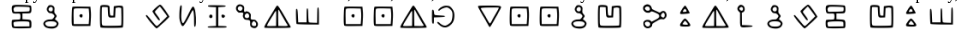

Криптография. Дана картинка с шифром.

формат флага CTF{}

Решение: Цитата одного из участников нашей команды: "В названии задания написано злой треугольник. Тут сразу 2 варианта: массоны и билл шифр. У массонов шифр не сходится. А при наборе в гугле "шифр билла шифра" вылазит табличка с нашими символами". При расшивровке получаем текст 
galf rehpic llib sllaf ytivarg ftc. Приводим к правильному формату перепечатов справа налева.

Флаг `CTF{GRAVITY_FALLS_BILL_CIPHER_FLAG}`
